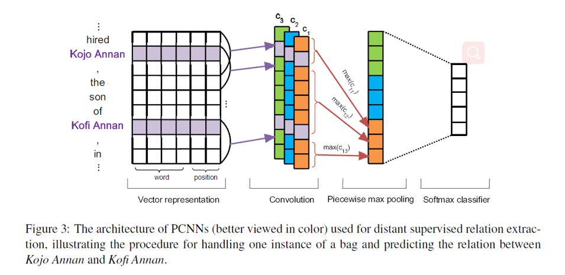

# PCNN

## the code for Distant Supervision for Relation Extraction via Piecewise Convolutional Neural Networks

### 模型结构

### 项目环境配置

* Python3.8
* jupyter notebook
* torch           1.6.0+cu10.2
* numpy           1.18.5

### 数据集下载
* 数据集下载地址链接：https://pan.baidu.com/s/1BaBYvvxWO8IwTSi-GEqUaA  
* 提取码：0d23
